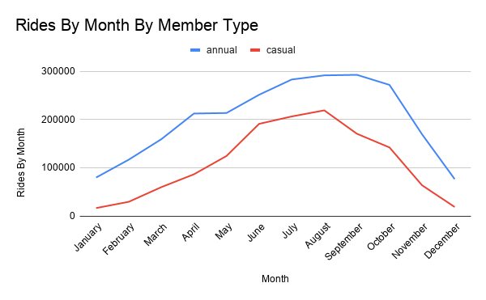

# Cyclistic Bike Share Analysis: Unlocking Member Growth

## Overview
Data analysis on trip data for Cyclistic, a bike-share program located in Chicago, for a 12 month period from May 2025 to April 2026.
The goal was to identify behavioral usage patterns for Members vs Casual Riders and provide input to the marketing team to formulate a marketing strategy for membership conversion.

## Tools Used
- **BigQuery and SQL** - to clean and analyze data
- **Google Sheets** - data visualization and charts creation

## Data
- The datasets that were used in this case study were taken from a data bucket named “divvy-tripdata”: https://divvy-tripdata.s3.amazonaws.com/index.html
- Data License Agreement: https://divvybikes.com/data-license-agreement

## Key findings
- Annual members took 82% more rides than casual riders over the 12-month period.
- Casual riders average nearly twice the ride duration of annual members.
- Members dominate weekday ridership; casual riders nearly match members on Saturdays.
- Casual riders consistently ride longer than members every day of the week.
- Both groups peak in summer; casual ridership drops near zero in winter while members stay above 100,000 rides.

## Key Visualizations

## Final recommendations
- Create a ride-count loyalty program that contains discounts for casual riders approaching annual membership count.
- Create optional programs for casual riders to understand benefits of becoming an annual member during weekends.
- Add a three-month pass during the summer which has the same benefits as an annual member.

## Repository Structure
- `sql/` — all cleaning and analysis queries in execution order
- `report/` — full analysis report (PDF)
- `images/` — chart visualizations
- `data/data_source.md` — data source and license information
